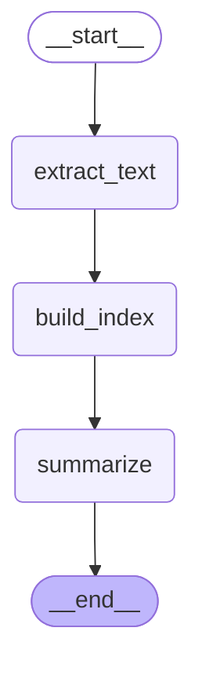
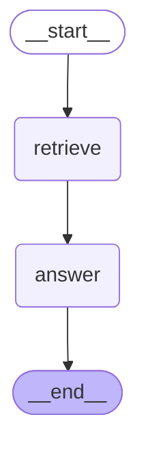

## Load Graph (extract_text → build_index → summarize)

```mermaid
---
config:
  flowchart:
    curve: linear
---
graph TD;
	__start__([<p>__start__</p>]):::first
	extract_text(extract_text)
	build_index(build_index)
	summarize(summarize)
	__end__([<p>__end__</p>]):::last
	__start__ --> extract_text;
	build_index --> summarize;
	extract_text --> build_index;
	summarize --> __end__;
	classDef default fill:#f2f0ff,line-height:1.2
	classDef first fill-opacity:0
	classDef last fill:#bfb6fc
```

## QA Graph (retrieve → answer)

```mermaid
---
config:
  flowchart:
    curve: linear
---
graph TD;
	__start__([<p>__start__</p>]):::first
	retrieve(retrieve)
	answer(answer)
	__end__([<p>__end__</p>]):::last
	__start__ --> retrieve;
	retrieve --> answer;
	answer --> __end__;
	classDef default fill:#f2f0ff,line-height:1.2
	classDef first fill-opacity:0
	classDef last fill:#bfb6fc
```

